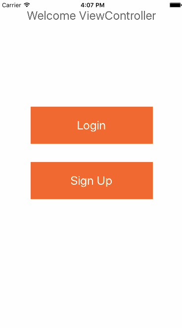
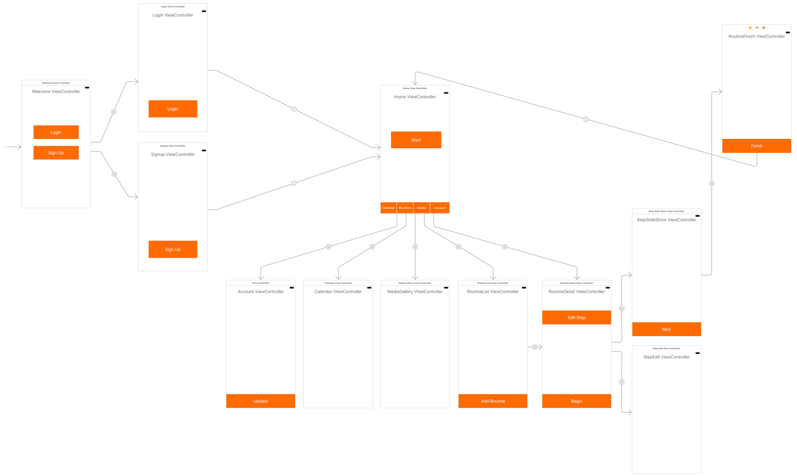

# Project - Planfit
Here's Planfit walkthrough:

Here's Planfit viewcontroller flow:

## User Stories

The following functionality is completed:

Basic - 
- [x] User should be able to create custom exercise routines by providing step by step instructions to the app.
- [x] Users can access a library of routines he/she has created.
- [x] Users can view and edit an existing routine in a routine detail view.
- [x] Users can select a routine to play. The routine should play to completion automatically.
- [x] Users can pause or exit the routine while the routine is playing.
- [x] User can go to prev step, pause or skip to the next step of a playing routine.
- [x] User can swipe to delete a workout.
- [x] User can swipe to delete a step in a workout.
- [ ] User can reorder steps in a workout by dragging and dropping.
- [x] A workout step shall include a name (required), description (optional), duration (optional), reps(optional), photo/video (optional).
- [x] A workout step in play mode will include a name, description, photo/video, duration countdown and way to pause, go to prev step and go to advance to the next step.
- [x] A workout entry in the workout library view will include a workout name and overall duration (something else?).
- [ ] User should be able to create visual content (photos or videos) and use them in the routine creation process.
- [x] User can add a photo/video from camera roll.
- [ ] User can invoke a routine by name handsfree. Routine will begin playing.

Accounts -
- [x] Users can sign up for an account in the app. 
- [ ] User can sign up for an account using Facebook/Instagram?
- [x] User account shall include a username, email address, user profile photo, a way to delete an account. 
- [x] User can login to their account using email/password.
- [ ] User can login to their account using Facebook/Instagram?
- [ ] User can delete their account.
- [x] User can logout of their account.
- [x] User can reset their password.

Calendar -
- [ ] User is able to see what is scheduled for this week, and transition to monthly view
- [ ] User when adds a workout to myWorkouts, all the workout dates get added to the calender
- [ ] User can remove a particular workout from the calendar
- [ ] User can have more than 1 workout on a given day
- [ ] Completing the workout add it to user history
- [ ] Incomplete workouts also show up in workout history
- [ ] Unstarted workouts do not show up in history
- [ ] On clicking on a particular workout user navigates to workout detail view
- [ ] User can add a time to the workout to get an alert or reminder.
